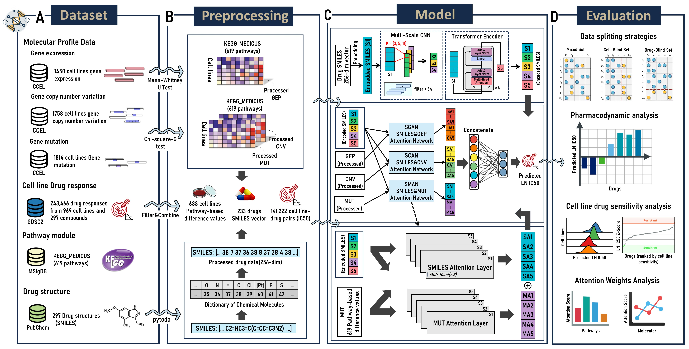

# OmicsTransMCA

Workflow Diagram (A) Data Selection: We acquired diverse datasets for training OmicsTransMCA from multiple databases. (B) Data Preprocessing: Statistical methods were employed to calculate the differences of various omics data within and outside biological pathways. These pathway-based difference values were utilized as cell line features. Additionally, pytoda was used to process SMILES chemical structure information. (C) Model Architecture: The model is presented in three sections, from top to bottom: The upper section illustrates the SMILES Encoding Network. The middle section depicts the overall model workflow. The lower section details the internal network structure of SMAN. (D) Evaluation of Predictions and Attention Weight Analysis: We evaluated the model using three distinct data partitioning strategies. Subsequently, we conducted drug efficacy analysis and attention weight analysis on the predicted results.

## Abstract
> Individualized prediction of cancer drug sensitivity is of vital importance in precision medicine. While numerous predictive methodologies for cancer drug response have been proposed, the precise prediction of an individual patient's response to drug and a thorough understanding of differences in drug responses among individuals continue to pose significant challenges. This study introduced a deep learning model OmicsTransMCA，which integrated transformer encoder, multi-scale convolutional networks and attention mechanisms to predict the sensitivity of cell lines to anticancer drugs, based on the omics data of cell lines and the SMILES representations of drug molecules. First, we use statistical methods to compute the differences in gene expression, gene mutation, and gene copy number variations between within and outside biological pathways, and utilized these pathway difference values as cell line features, combined with the drugs' SMILES chemical structure information as inputs to the model. Then the model integrates various deep learning technologies multi-scale convolutional networks and transformer encoder to extract the properties of drug molecules from different perspectives, while an attention network is devoted to learning complex interactions between the omics features of cell lines and the aforementioned properties of drug molecules. Finally, a multilayer perceptron (MLP) outputs the final predictions of drug response (half maximal inhibitory concentration, IC50). Our model exhibits higher accuracy in predicting the sensitivity to anticancer drugs comparing with other methods proposed recently. It is found that PARP inhibitors, and Topoisomerase I inhibitors were particularly sensitive to SCLC when analyzing the drug response predictions for lung cancer cell lines. Additionally, the model is capable of highlighting biological pathways related to cancer and accurately capturing critical parts of the drug's chemical structure. In summary, the OmicsTransMCA model suggests potential as a robust support in individualized cancer treatment.
>
> 
